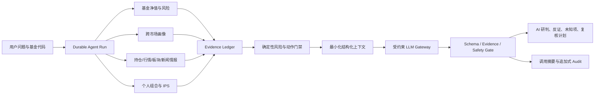

# 2026-07-13 证据约束的大模型投资研判

## 1. 本次迭代解决什么问题

此前的“投资 Agent”只有可恢复工作流、真实数据工具、Evidence、审计链和确定性风险门禁，
但没有真实调用大模型。它能计算，却不能把大盘、基金底层持仓、板块、新闻、组合重合和
个人约束组织成一份有反证、有未知项、有复核条件的投资研判。

本次迭代引入真实 LLM 合成节点，但没有把所有逻辑交给模型。目标是提高经过风险和成本约束后
的决策质量，而不是承诺收益或让模型预测“必涨/必跌”。系统现在把职责拆成三层：

1. 真实数据工具负责获取可追溯事实。
2. 确定性代码负责净值、收益、回撤、暴露、预算和动作门禁。
3. 大模型负责解释 Evidence、组织正反证据、识别未知项并生成复核计划。

## 2. 端到端架构



关键边界：模型没有工具权限，不能在生成过程中重新请求网页、行情或新闻；模型也不能把确定性
动作从“仅研究”改成“加仓”。工具和模型调用都先形成 Step，随后保存不可变 Evidence 摘要。

## 3. 新增模块

### 3.1 `backend/fund_intelligence.py`

按基金真实投资市场聚合上下文：

| 数据 | 当前实现 | 失败行为 |
|---|---|---|
| 基金底层持仓 | 最新可得定期报告；联接基金穿透目标 ETF 后按披露比例缩放 | 不猜测持仓，情报状态为不可用 |
| A/H 股持仓行情 | 腾讯证券单股行情 | 单只失败写入 `failed`，不生成替代价格 |
| 美股持仓行情 | 现有专业源优先行情路由 | 同上 |
| A/H 股新闻 | 东方财富个股新闻聚合，保留证券时报、财联社等原发布机构 | 8 秒硬超时，缺失记入质量 |
| 美股新闻/情绪 | 配置后的 Alpha Vantage `NEWS_SENTIMENT` | 未配置 Key 时不伪造新闻或情绪 |
| A 股行业/概念 | 现有真实行业与概念工具 | 超时后标记不可用 |
| 港股/美股板块 | 当前没有批准的实时海外板块源 | 使用披露行业和持仓行情，不套用 A 股板块 |

新闻标题、摘要和 URL 均标记 `untrusted_external_content=true`。新闻只可成为催化剂、风险或
待验证线索，不能独立触发仓位动作。

### 3.2 `backend/agent/llm_gateway.py`

支持以下显式提供商：

- `openai`：默认使用 Responses API。
- `dashscope`：使用阿里云百炼 OpenAI-compatible Chat Completions。
- `openai_compatible`：必须显式提供 HTTPS Base URL 和 API 风格。

网关行为：

- 没有提供商、模型、Base URL 或 Key 时拒绝调用。
- 只对网络错误、429 和 5xx 做有界重试。
- 默认请求时限 75 秒，输入字符和输出 Token 均有上限。
- OpenAI Responses 请求设置 `store=false` 并申请严格 JSON Schema。
- 兼容接口请求 JSON Object，随后仍由本服务执行完整 Pydantic 校验。
- 对外只返回提供商、模型、端点主机、地域、时延、Token 和哈希，不返回 Key。

### 3.3 `backend/agent/synthesis.py`

模型输入是经过裁剪的 JSON，而不是数据库、网页或完整原始 Prompt。主要内容包括：

- 用户本轮决策问题和 3-12 个月决策周期。
- Evidence 目录：ID、来源、数据日期、质量和 SHA-256。
- 基金趋势、回撤、历史条件分布、费用、规模、经理和基准摘要。
- 基金市场画像、披露持仓、底层行情、板块和新闻摘要。
- 同类替代品和披露变化。
- 可选的去标识化组合聚合摘要。
- 确定性策略允许的唯一动作 `allowed_action`。

模型输出必须符合 `fund_ai_synthesis.v1`：

- `action`、`confidence`、`headline` 和直接回答。
- 市场、基金、组合三个研判面。
- 催化剂、主要风险、反证和未知项。
- 增加前提、降低暴露条件、结论失效条件和复核天数。
- 市场、持仓、新闻和个人组合的数据覆盖声明。
- 每个判断所引用的 Evidence ID。

## 4. 质量和安全门禁

模型输出只有同时通过以下检查才会显示为“真实模型调用”：

1. JSON 可以解析并通过严格 Pydantic Schema，额外字段拒绝。
2. `action` 与确定性 `allowed_action` 完全一致。
3. Action Plan 的当前动作与顶层动作一致。
4. 所有 Evidence ID 必须存在于本 Run 的 Evidence 目录。
5. 没有新闻时不得宣称使用了新闻；未共享组合时不得宣称使用了组合。
6. 检测“保证盈利、稳赚、必涨、必跌、无风险收益”等承诺。
7. 模型自然语言不得复述精确百分比、金额或净值，防止模型改写数值。
8. 新闻中疑似“忽略此前指令、系统提示词、调用工具”等内容只记录为注入风险标志。

任一检查失败时，保存真实失败原因并返回 `status=unavailable`。不存在本地模板结论或另一家模型
自动兜底，因此不会出现“页面看起来像 AI，实际上没有模型调用”的情况。

## 5. 私有组合边界

默认配置为 `LLM_PRIVATE_CONTEXT_ENABLED=false`。此时即使用户勾选“应用真实持仓与约束”：

- 确定性风险门禁仍在本机读取组合。
- 发送给模型的私有上下文被替换为 `not_shared_with_model`。
- 模型允许动作降级为 `research_only`。
- 私有 Evidence ID 不进入模型上下文。

只有部署端明确开启该变量并且用户本轮勾选组合时，模型才收到聚合摘要。摘要不包含姓名、账户号、
OCR 原图、原始交易流水或其他身份标识。当前产品尚无登录和多租户隔离，因此生产环境应继续保持
关闭；完成登录、逐用户授权、撤回同意和数据处理协议后再开放。

## 6. 投资策略依据与采用边界

模型 Prompt 使用的是研究顺序，不是“万能预测公式”：

1. 先看组合适配、持仓重合和集中风险，再讨论单只基金机会。
2. 区分底层市场、板块环境、基金载体和份额类别。
3. 使用中期趋势和动量作为状态变量，同时明确动量在高波动反弹期可能出现严重反转。
4. 比较同类相对表现、费用、跟踪载体、基金规模和披露持仓。
5. 把新闻作为催化或风险线索，不把相关性写成盈利因果。
6. 用失效条件、分批执行和固定复核周期代替一次性满仓判断。

参考依据：

- Investor.gov 对[组合再平衡](https://www.investor.gov/introduction-investing/investing-basics/glossary/rebalancing)的定义强调让组合回到目标配置，本系统因此先做组合约束而不是先追热门基金。
- SEC/Investor.gov 的[基金与 ETF 费用说明](https://www.investor.gov/introduction-investing/general-resources/news-alerts/alerts-bulletins/investor-bulletins/mutual-fund-and-etf-fees-and-expenses-investor-bulletin)指出费用会降低投资回报，同类替代比较因此保留费用与份额类别。
- NBER 的[Momentum Crashes](https://www.nber.org/papers/w20439)显示动量策略会出现少见但严重的连续亏损，系统不会把趋势信号当作确定性预测。
- [Volatility Managed Portfolios](https://www.nber.org/papers/w22208)提供波动管理研究依据，但后续的[样本外研究](https://papers.ssrn.com/sol3/papers.cfm?abstract_id=3357038)指出合理实时版本可能弱于静态组合，因此当前只把波动用于风险门禁，不宣称波动择时必然增收。

## 7. API 与结果协议

### 模型状态

```http
GET /api/v1/agent/model/status
```

该接口不返回密钥，只返回是否配置、提供商、模型、API 风格、端点主机、数据地域、私有上下文策略、
Prompt 模板和输出 Schema 版本。

### 创建研究任务

```json
{
  "intent": "fund_deep_research",
  "code": "013403",
  "months": 60,
  "question": "结合未来 3-12 个月的市场、底层持仓、新闻和我的组合约束，我现在应该如何管理这只基金？",
  "include_market_intelligence": true,
  "include_ai_synthesis": true,
  "include_portfolio_context": true,
  "include_disclosure_changes": true,
  "include_alternatives": true
}
```

最终结果协议为 `fund_deep_research.v5`，新增 `market_intelligence` 和 `ai_synthesis`。模型失败只会让
Run 进入 `partial`，不会删除已经成功持久化的确定性研究 Evidence。

## 8. 阿里云百炼部署示例

仅使用百炼按量付费/业务空间 API Key；官方文档明确说明 Coding Plan 和 Token Plan Key 不适用于
自定义应用后端。Base URL 与 API Key 必须属于同一地域和计费方案。

创建只允许 root 和服务管理员读取的环境文件：

```bash
sudo install -d -m 750 /etc/stock-assistant
sudo install -m 600 /dev/null /etc/stock-assistant/stock-assistant.env
sudo nano /etc/stock-assistant/stock-assistant.env
```

```dotenv
LLM_PROVIDER=dashscope
LLM_MODEL=qwen-plus
DASHSCOPE_API_KEY=替换为百炼按量付费API-Key
LLM_DATA_REGION=cn-beijing
LLM_PRIVATE_CONTEXT_ENABLED=false
LLM_TIMEOUT_SECONDS=75
```

`deploy/stock-assistant-api.service` 已支持：

```ini
EnvironmentFile=-/etc/stock-assistant/stock-assistant.env
```

重启和核验：

```bash
sudo systemctl daemon-reload
sudo systemctl restart stock-assistant-api
curl -s http://127.0.0.1:8000/api/v1/agent/model/status
```

百炼配置参考：

- [Base URL 与地域](https://help.aliyun.com/zh/model-studio/base-url)
- [OpenAI 兼容 Chat Completions](https://help.aliyun.com/zh/model-studio/compatibility-of-openai-with-dashscope)

## 9. 验证结果

- 后端全量：195 项通过。
- 前端：Vite production build 通过。
- 真实基金：`013403` 正确识别为港股 QDII。
- 真实情报：基金联接目标 ETF 穿透成功，底层港股行情和新闻发布机构可用。
- 性能：新闻请求增加 8 秒硬上限并并发执行，避免无超时的单个上游阻塞整个 Run。
- 无模型配置：真实 Run 执行 10 个步骤，`ai_synthesis.reason_code=model_not_configured`，没有 AI 兜底文本。
- 响应式：桌面与 390x844 视口无横向溢出，历史默认折叠，AI 状态先于确定性门禁展示。

## 10. 尚未解决的生产缺口

1. 服务器仍需配置一个真实模型 API Key，才能完成端到端模型调用验收。
2. 登录、用户授权、租户隔离、组合出境同意和撤回机制尚未完成，私有组合模型上下文必须保持关闭。
3. 港股/美股缺少已批准的实时行业/概念板块源；当前只使用披露行业和持仓行情。
4. 美股新闻需要 Alpha Vantage Key；专业中文财经新闻可继续接入有授权的 Tushare 或商业资讯源。
5. 当前 SQLite + 单进程 Worker 只适合单机迁移阶段，多实例前需要 PostgreSQL、队列/Temporal 和分布式幂等。
6. 需要积累模型离线评测集：事实一致性、Evidence 引用率、动作冲突率、未知项召回、提示注入和用户决策结果。
7. 只有完成真实模型调用、人工金融评审、Prompt 版本灰度和成本/时延监控后，模型节点才能从内部试用进入生产可用状态。
